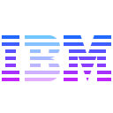

<h1 align="center"> BlueBank </h1> <br>

|Spring Boot | IBM | Gama Academy |
| --------------- | --------------- | :-------: |
| | | |


<p align="center">
  Desafio oferecido pela Gama pelo BootCamp  da IBM, com o intuito de criar uma API RestFul utilizando Spring boot e spring data. Aplicação  terá o propósito de gerenciar contas bancárias.
</p>

## Conteúdo

- [Introducao](#introducao)
- [Funcionalidades](#funcionalidades)
- [Requerimentos](#requerementos)
- [Start inicial](#startInicial)
- [API](#api)
- [Agradecimentos](#agradecimentos)

## Introducao

[](https://opensource.org/licenses/Apache-2.0)
[](https://www.codacy.com/app/joneubank/microservice-template-java?utm_source=github.com&amp;utm_medium=referral&amp;utm_content=overture-stack/microservice-template-java&amp;utm_campaign=Badge_Grade)
[](https://circleci.com/gh/overture-stack/microservice-template-java/tree/master)

## Funcionalidades

* Criar contas bancárias.
* Realizar depósito, saque e transferência.
* Gerar extrato.


## Requerimentos
Para executar está aplicação necessário ter instalado:
### Local
* [Java 17 SDK](https://www.oracle.com/java/technologies/downloads/#jdk17-windows)
* [Maven](https://maven.apache.org/download.cgi)

## Start inicial
Certifique-se de ter os recursos acima instalados.

### Clonando o projeto

```bash
git clone https://github.com/paulocfj/blueBank.git
cd bluebank
```

### Run Local
```bash
$ mvn spring-boot:run
```

Aplicação está definida para rodar na porta: `8080`

## API
A seguir será detalhado como a API está estruturada.

### Estrutura
* Controller
  Camada responsável por conduzir a informação do cliente aos dados, dos dados ao cliente.
* Service
  Camada responsável por manipular as regras de negócios.
* Entity
  Camada responsável por manipular os dados persitiveis.
* Repository
  Camada de implementação para aplicação da persistência de dados.
* Request
  Camada responsável pela transferência dos dados recebidos pelas requisições.
* Response
  Camada responsável pela transferência dos dados enviados para as requisições.

### Contrato da API
	Após iniciado a aplicação acessar a rota pelo o navegador.
	Será informado todas as rotas disponíveis após o acesso.

[swagger-ui Contrato da API](http://localhost:8080/swagger-ui.html)

`http://localhost:8080/swagger-ui.html`

### Acesso ao Banco H2
    Foi construido a persistência de dados utilizando o banco em memório H2.
    Para Acessa-lo, clique no link: 
* [H2](http://localhost:8080/h2-console) ou http://localhost:8080/h2-console
* No campo `JBDC URL` troque o contéudo por `jdbc:h2:file:C:/data/sample`


    Para acessar as estrutura do banco e visualizar o script das tabelas:
    blueBank\database.sql

## Integrantes
[Anderson Dantas](https://www.linkedin.com/in/anderson-dantas-8072731a5/)
[Mateus Ferreira]()
[Paulo Cesar](https://www.linkedin.com/in/paulo-cesar-ferreira-junior-83310085/)

## Agradecimentos
Agradecemos a todos as pessoas que nos apoiaram neste projeto, somos gratos por todos os conhecimento que obtemos ao longo do bootCamp ofericido pela IBM em parceria com Academia Gama.
<br>Que ao longo desta jornada adquirimos novos aprendizados, conceitos e histórias vivênciadas, e, claro ao grande aprendizado que foi nos passado pela a incrivel professora Camila Ávila.
Também foi de grande ajuda toda equipe da Gama que nos auxiliou nesta jornada. E pela equipe da IBM que ao longo desta trajetória nos ensinou um pouco mais do mercado de trabalho, da família IBM e um pouco sobre suas práticas.

Att,
<br>Grupo Not-Found
